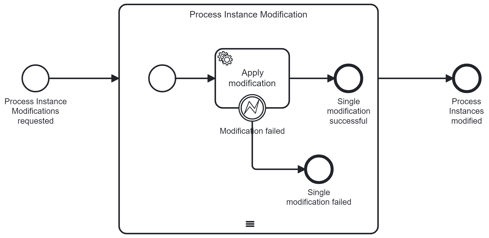

# Concept Processinstance-Search for Batch-Processing

Search in Elasticsearch with Kibana Frontend

Benefits:

- Automatic export of records to CSV
- Highly and simply customizable

Downsides:

- Nesting of queries need manual interaction (Export results and use them as
  input for next query)

## Find all Process Instances, that wait in Activity "a" with Error Message "b"

### Index: `operate-incident`

Contains: All Incidents, that occurred. Build for Operate and its search.

KQL-Parameters: `state : "ACTIVE" and errorMessage : *ure* and errorMessage : 1`

Result: `processInstanceKey`

Benefit: Records will be updated in `state` when the issue is resolved.

See:
[error-message-search-curl.txt](elastic-queries/error-message-search-curl.txt)

### Index: `operate-event`

Contains: All Zeebe-events imported by Operate. eventTypes on BPMN elements and
Zeebe constructs.

KQL-Parameters: `eventType :"FAILED" and metadata.jobRetries >= 0`

Result: `processInstanceKey`, `flowNodeInstanceKey`

Benefit: Records will be updated when issue is resolved

Downside: No field with error message available

See:
[failed-jobs-with-retries-curl.txt](elastic-queries/failed-jobs-with-retries-curl.txt)

### Index: `zeebe-record-job`

Contains: All exported Zeebe-events for all jobs.

Search with KQL-Parametern:
`intent : "FAILED" and value.retries > 0 and value.errorMessage : *fail* `

Result: `value.processInstanceKey`, `value.elementInstanceKey`

Downside: Records won't be deleted here if issue is resolved. Another record
with `intend: "CANCELED"` is inserted for the same job.

See:
[failed-jobs-with-retries-left-curl.txt](/elastic-queries/failed-jobs-with-retries-left-curl.txt)

## Correlate Messages to multiple Process Instances

Use either one or multiple queries from above to identify the process instances.

### Get the correlation values for the process instances

Index: `operate-variable`

KQL-Parameters:
`name : "businessKey" and (processInstanceKey : 2251799813742278 or processInstanceKey : 2251799813742707)`

`businessKey` is the variable name.

Result: `value`

See:
[variables-for-correlation-curl.txt](elastic-queries/variables-for-correlation-curl.txt)

### Execute the command for correlation key for all process instances

Use the values from the last search for the `zbctl` command:

```
zbctl publish message repairMessage1 --correlationKey 7 --variables "{\"issue1Message\": \"repaired manually\"}"
```

In this example, `7` is the value for the `businessKey`, which is the variable
for the message correlation.

## Apply Multiple Process Instance Modifications in Batch

Search for all process instances that have to be modified with one or more of
the queries mentioned above.

Start a process instance of `ProcessInstanceModificationProcess`. It applies the
process instance modifications in a multi instance subprocess and catches errors
if the modification command throws an exception for a single modification.



Example payload for the process start:

```
{
    "modifications": [
        {
            "processInstanceToModifyKey": 2251799833556731,
            "terminatedElementInstance": 2251799833557478,
            "activatedElement": "Task_1"
        },
        {
            "processInstanceToModifyKey": 2251799833558304,
            "terminatedElementInstance": 2251799833558309,
            "activatedElement": "Task_2"
        }
    ]
}
```

Result variable of a process instance:

```
["completed: 2251799833556731","completed: 2251799833558304"]
```

# Low Level Kibana Instructions

Kibana is not able to share the Discovery queries as a single entity. Here is
the process to create them.

1. Create Index-Patterns and the base for the searches. Index Patterns are
   created on Stack Management -> Index Patterns. The required Index patterns
   are:
   - operate-incident\*
   - operate-event\*
   - zeebe-record-job\*
   - operate-variable\*
2. Create the queries in Discover. Select an index pattern and add the search
   parameters in the Search field. Autocompletion gives valid proposals. Select
   relevant fields as column for the output with the plus-sign next to the field
   name.
3. Save the query with Save from the toolbar.
4. Open saved queries from the toolbar when required.
5. Share the results as CSV files. They contain only the selected output
   columns.
