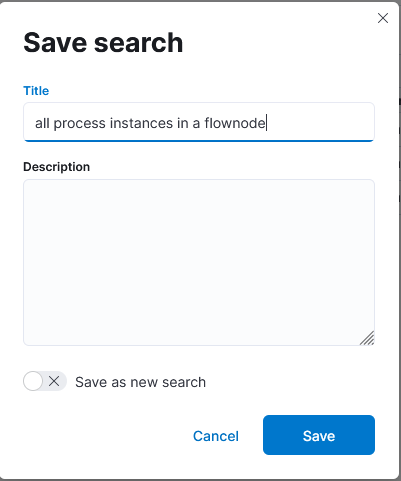
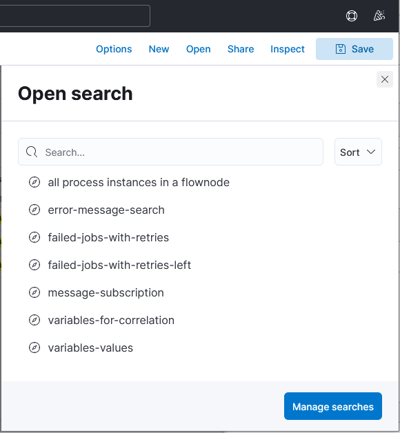
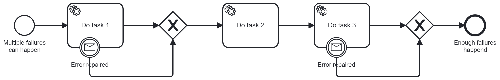

# Concept Processinstance-Search for Batch-Processing

Search in Elasticsearch with Kibana Frontend

Benefits:

- Automatic export of records to CSV
- Highly and simply customizable

Downsides:

- Nesting of queries need manual interaction (Export results and use them as
  input for next query)

## Kibana setup instructions

Kibana has no export function to transport queries from one installation into
another. They have to be created in the frontend.

1. Create Index-Patterns as the base for the queries. Index Patterns are created
   on Mangement -> Stack Management -> Index Patterns. The required Index
   patterns are:
   - operate-incident\*
   - operate-event\*
   - zeebe-record-job\*
   - operate-variable\*
2. Create the queries in Analytics -> Discover. Select an index pattern and add
   the search parameters in the Search field. Autocompletion gives valid
   proposals. Select relevant fields as column for the output with the plus-sign
   next to the field name. Details about the required queries will follow below.
3. Save the search with Save from the toolbar.<br>
   <br>
   
4. Open saved searches from the toolbar when required.<br>
   
5. Share the results as CSV files. They contain only the selected output
   columns.<br>
   

## Find all Process Instances, that wait in Activity "a" with Error Message "b"

### Index: `operate-flownode-instance`

Search on the `operate-flownode-instance` index for active tasks on all process
instances and all versions.

KQL-Query-Parameter example:
`state : "ACTIVE" and flowNodeId : "Activity_Task_2"`

The important output columns would be:

- `processInstanceKey`
- `bpmnProcessId`
- `flowNodeId`
- `state`

### Index: `operate-incident`

Search on the `operate-incident` index for active incidents with the error
messages.

KQL-Query-Parameter example:
`state :"ACTIVE" and (errorMessage : exa* or errorMessage : no*)`

The important output columns would be:

- `processInstanceKey`
- `bpmnProcessId`
- `flowNodeInstanceKey`
- `flowNodeId`
- `errorMessage`
- `state`

### Index: `operate-event`

Search on the `operate-event` index for further failed tasks where the retry is
not 0 now.

KQL-Query-Parameter example: `eventType :"FAILED" and metadata.jobRetries > 0`

The important output columns would be:

- `processInstanceKey`
- `bpmnProcessId`
- `flowNodeInstanceKey`
- `flowNodeId`
- `eventType`
- `metadata.jobRetries`

## Correlate Messages to multiple Process Instances

Use either one or multiple queries from above to identify the process instances.

### Get the correlation values for the process instances

#### Index: `operate-variable`

Search for all values of a given process variable in some process instances

KQL-Query-Parameter example:
`name : "businessKey" and (processInstanceKey : 2251799813742278 or processInstanceKey : 2251799813742707)`

`businessKey` is the variable name.

The important output columns would be:

- `processInstanceKey`
- `name`
- `value`

### Execute the command for correlation key for all process instances

Use the values from the last search for the `zbctl` command:

```
zbctl publish message repairMessage1 --correlationKey 7 --variables "{\"issue1Message\": \"repaired manually\"}"
```

In this example, `7` is the value for the `businessKey`, which is the variable
for the message correlation.

The message is defined with name `repairMessage1` in the BPMN diagram and a
variable `issue1Message` with value `repaired manually` is created.

## Apply Multiple Process Instance Modifications in Batch

Search for all process instances that have to be modified with one or more of
the queries mentioned above.

Required values to execute process instance modifications:

- `processInstanceKey`
- `flowNodeInstanceId` - of the task to terminate
- `flowNodeId` - of the task to activate

Start a process instance of `ProcessInstanceModificationProcess`. It applies the
process instance modifications in a multi instance subprocess and catches errors
if the modification command throws an exception for a single modification.


Example payload for the process start:

```
{
    "modifications": [
        {
            "processInstanceToModifyKey": 2251799833556731,
            "terminatedElementInstance": 2251799833557478,
            "activatedElement": "Task_1"
        },
        {
            "processInstanceToModifyKey": 2251799833558304,
            "terminatedElementInstance": 2251799833558309,
            "activatedElement": "Task_2"
        }
    ]
}
```

Result variable of a process instance:

```
["completed: 2251799833556731","completed: 2251799833558304"]
```

## Demo/Test setup

Deploy this example process to your cluster:
[Example process](example-processes/multiple-failures-process.bpmn)



Use `zbctl create instance` to start a few process instances with different
variables like `businessKey`.

Use `zbctl activate jobs` and `zbctl complete job` to complete a few activities.

Use `zbctl fail job --retries 2 --retry-backoff 5m` to create failed, but active
tasks.

Use `zbctl fail job --retries 0` to create incidents.
